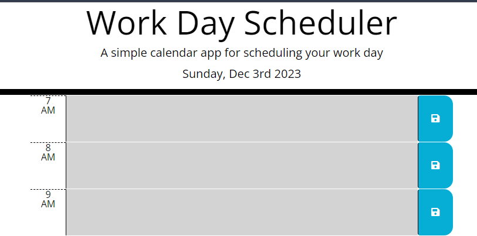

# 05 Third-Party API: Daily Work Planner

A straight forward calender program that lets users record events for every hour of the day. This browser-based application will use jQuery to dynamically update its HTML and CSS. To enable user to remain visible even after the brower has been opened, closed or refreshed. Information about the current date and time was capture using Moment.js.

# Application View

